# TRACE

> **Tamper-Resistant Record and Audit Chain for Evidence**

A chain-of-custody and evidence integrity platform designed to preserve, organize, verify, and track digital evidence throughout its lifecycle.

---

## Why TRACE?

Digital evidence is often fragmented across screenshots, emails, PDFs, videos, recordings, and chat exports.

Once evidence changes hands, proving that it remained unaltered becomes difficult.

TRACE addresses this problem by providing:

* Secure evidence collection
* SHA-256 integrity verification
* Chain-of-custody tracking
* Tamper-evident audit logs
* Timeline reconstruction
* Evidence bundle generation
* Verification reports

Rather than attempting to prove authenticity before collection, TRACE focuses on preserving **integrity after collection** and maintaining a transparent audit trail.

---

## The Problem

Investigators, organizations, compliance teams, and individuals frequently struggle to answer:

* Who collected this evidence?
* When was it collected?
* Has it been modified?
* Who accessed it?
* Can its integrity be verified?

Traditional storage systems answer none of these reliably.

TRACE was built to change that.

---

## Features

### Case Management

Create and organize investigation cases.

```text
Case
├── Evidence
├── Timeline
├── Audit Logs
└── Reports
```

### Evidence Upload

Upload:

* Images
* PDFs
* Videos
* Audio files
* Documents

### SHA-256 Hash Verification

Every uploaded file receives a cryptographic hash.

```text
Original File
      ↓
SHA-256 Hash
      ↓
Stored in Database
      ↓
Future Verification
```

### Chain of Custody

Track every evidence event:

* Upload
* Verification
* Transfer
* Export

### Evidence Timeline

Automatically reconstruct the sequence of events.

### PDF Reports

Generate investigation-ready reports.

### Evidence Bundle Export

Export complete evidence packages including:

```text
bundle.zip
├── evidence/
├── report.pdf
├── manifest.json
└── hashes.json
```

---

## Architecture

```mermaid
sequenceDiagram
    actor Investigator
    participant F as Frontend (React/Vite)
    participant B as Backend (Express API)
    participant DB as PostgreSQL (pgvector)
    participant AI as AI Engine (Gemini / Ollama)

    Investigator->>F: 1. Toggle AI Settings (Gemini / Local)
    Investigator->>F: 2. Upload Evidence (PDF, Image, etc.)
    F->>B: 3. HTTP POST /cases/:id/evidence
    
    rect rgb(20, 30, 40)
        note right of B: Cryptographic Verification
        B-->>B: Compute SHA-256 Hash
        B->>DB: Record Custody Chain Log
    end
    
    B->>F: 4. Evidence Ingested Successfully
    
    Investigator->>F: 5. Request AI Analysis & Entity Extraction
    F->>B: 6. HTTP GET /cases/:id/entities
    
    rect rgb(30, 20, 40)
        note right of B: AI Processing Pipeline
        B->>AI: Send prompt & raw evidence data
        AI-->>B: Return structured JSON entities
        B->>AI: Generate 1536-dimensional embeddings
        AI-->>B: Return vector arrays
        B->>DB: Store embeddings for Semantic Search
    end
    
    B->>F: 7. Return Analysis Results
    F->>Investigator: 8. Display Dynamic Investigation Timeline
```



---

## Technology Stack

### Frontend

* React
* TypeScript
* Vite
* Tailwind CSS
* React Three Fiber (3D UX)

### Backend

* Node.js
* Express
* TypeScript
* Multer
* pg

### Database

* PostgreSQL (pgvector)

### Security

* Node Crypto
* SHA-256 Hashing

### AI Integration

* Google Gemini API
* Local Ollama Instance

### Reporting & Bundling

* PDFKit
* Archiver

---

## Project Structure

```text
TRACE/
├── frontend/
├── backend/
├── uploads/
├── reports/
├── specs/
│   └── 001-trace/
│       ├── spec.md
│       ├── plan.md
│       └── tasks.md
└── README.md
```

---

## MVP Scope

### Included

* Create Case
* Upload Evidence
* Generate SHA-256 Hash
* Store Metadata
* Log Custody Events
* Evidence Timeline
* Verify Integrity
* PDF Report Generation
* Evidence Bundle Export
* AI Semantic Search & Analysis
* 3D WebGL Dashboard

### Future Roadmap

* Multi-user authentication
* Role-based access control
* Digital signatures
* Secure evidence sharing
* Evidence confidence scoring
* Forensic integrations
* Court-ready workflows

---

## Demo Flow

1. Set up AI Configuration (Gemini / Ollama)
2. Create a Case
3. Upload Evidence
4. Generate Hash
5. View Metadata
6. Log Custody Event
7. Trigger AI Entity Extraction & Semantic Search
8. Verify Integrity
9. Generate PDF Report
10. Export Evidence Bundle

---

## Security Principles

TRACE is built around three core principles:

### Integrity

Evidence must remain unchanged after collection.

### Accountability

Every action must be logged.

### Transparency

Evidence history must be verifiable.

---

## Disclaimer

TRACE verifies evidence integrity after collection.

TRACE does not claim to prove evidence authenticity before collection.

---

## Team

**Solo Developer Project**

Built for Hackathon 2.

---

## License

MIT License
