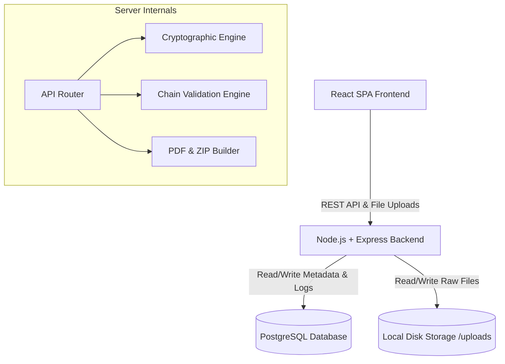
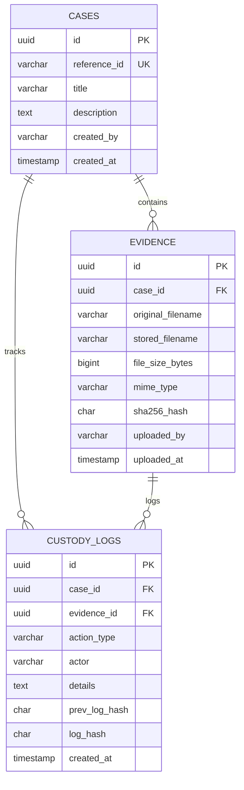
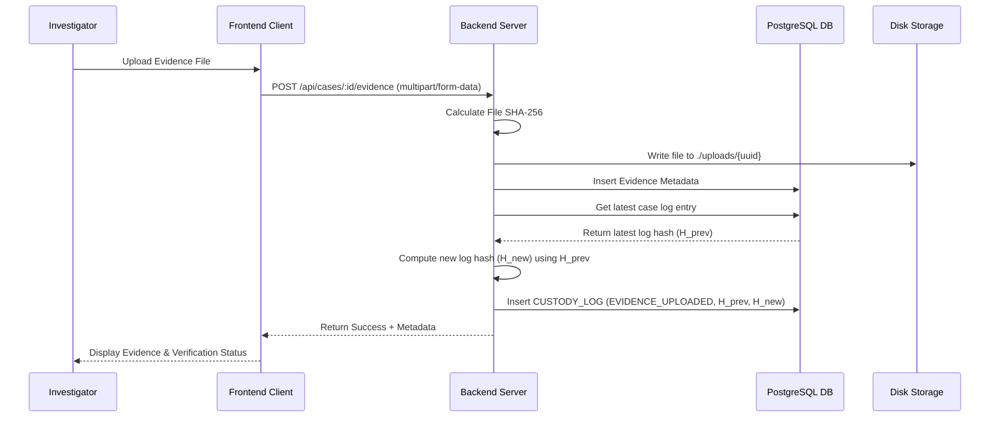

# TRACE Implementation Plan (specs/001-trace/plan.md)

## 1. System Architecture

The TRACE platform will be constructed using a standard client-server architecture designed for rapid development during the hackathon, while enforcing strict separation of concerns to guarantee audit reliability.



### Architecture Rationale
* **React + Tailwind Frontend:** Allows for rapid iteration of a beautiful, responsive, dashboard-style UI. 
* **Express + Node.js Backend:** Handles asynchronous file I/O efficiently, calculates SHA-256 hashes using the native `crypto` module, and streams zip bundles.
* **PostgreSQL:** Provides strict schema constraints and transaction support. This ensures that the hash-chained custody logs are written atomically with the evidence uploads.
* **Local Disk Storage:** A simple, dedicated `./uploads/` directory on the server minimizes network overhead during the hackathon while retaining the ability to swap to AWS S3 or MinIO in production.

---

## 2. Database Design

We will use PostgreSQL to maintain metadata and audit trails. The audit log utilizes a hash-chain mechanism where each entry is cryptographically linked to the previous entry.



### Database Schema Definitions (DDL)

```sql
-- Create Cases Table
CREATE TABLE cases (
    id UUID PRIMARY KEY DEFAULT gen_random_uuid(),
    reference_id VARCHAR(50) UNIQUE NOT NULL,
    title VARCHAR(255) NOT NULL,
    description TEXT,
    created_by VARCHAR(100) NOT NULL,
    created_at TIMESTAMP WITH TIME ZONE DEFAULT CURRENT_TIMESTAMP
);

-- Create Evidence Table
CREATE TABLE evidence (
    id UUID PRIMARY KEY DEFAULT gen_random_uuid(),
    case_id UUID REFERENCES cases(id) ON DELETE CASCADE,
    original_filename VARCHAR(255) NOT NULL,
    stored_filename VARCHAR(255) NOT NULL,
    file_size_bytes BIGINT NOT NULL,
    mime_type VARCHAR(100) NOT NULL,
    sha256_hash CHAR(64) NOT NULL,
    uploaded_by VARCHAR(100) NOT NULL,
    uploaded_at TIMESTAMP WITH TIME ZONE DEFAULT CURRENT_TIMESTAMP
);

-- Create Custody Logs Table (Append-Only)
CREATE TABLE custody_logs (
    id UUID PRIMARY KEY DEFAULT gen_random_uuid(),
    case_id UUID REFERENCES cases(id) ON DELETE CASCADE,
    evidence_id UUID REFERENCES evidence(id) ON DELETE SET NULL,
    action_type VARCHAR(50) NOT NULL,
    actor VARCHAR(100) NOT NULL,
    details TEXT,
    prev_log_hash CHAR(64),
    log_hash CHAR(64) NOT NULL,
    created_at TIMESTAMP WITH TIME ZONE DEFAULT CURRENT_TIMESTAMP
);

-- Indexing for quick lookups and integrity scans
CREATE INDEX idx_evidence_case ON evidence(case_id);
CREATE INDEX idx_logs_case ON custody_logs(case_id);
CREATE INDEX idx_logs_evidence ON custody_logs(evidence_id);
```

---

## 3. Cryptographic Chain-of-Custody Log Workflow

To ensure audit trails are tamper-evident, we implement a sequential hash chain. Any tampering (editing or deleting log entries) breaks the chain.

### Hash Chaining Mechanics
When inserting a new log entry $E_n$:
1. Retrieve the latest log entry $E_{n-1}$ for the case. Let its hash be $H_{n-1}$.
2. If no previous log entry exists (the first log for the case), set $H_{n-1} = \text{"0" \times 64}$ (a string of 64 zeros).
3. Construct the serialization payload:
   $$P_n = id + \text{"|"} + case\_id + \text{"|"} + (evidence\_id \lor \text{""}) + \text{"|"} + action\_type + \text{"|"} + actor + \text{"|"} + details + \text{"|"} + H_{n-1}$$
4. Compute the SHA-256 hash of $P_n$ to generate $H_n$.
5. Insert $E_n$ containing `prev_log_hash = ` $H_{n-1}$ and `log_hash = ` $H_n$.

### Verification Workflow
To verify the audit log chain:
1. Fetch all logs for a case ordered by `created_at` ASC.
2. Initialize `expected_prev_hash = "0" * 64`.
3. For each log entry $E_i$:
   * Verify that $E_i.prev\_log\_hash$ equals `expected_prev_hash`.
   * Recompute $H_{recalc}$ using the serialization payload rules.
   * Verify that $E_i.log\_hash$ equals $H_{recalc}$.
   * Set `expected_prev_hash = E_i.log_hash`.
4. If all checks pass, the audit log chain is sound. If any step fails, the system triggers a tamper alert.



---

## 4. API Endpoint Specifications

### Case API

* **`GET /api/cases`**
  * **Description:** Retrieve all cases.
  * **Response:** `200 OK`
    ```json
    [
      {
        "id": "e6741bfa-8a8b-4b2a-bf0c-26798e94e438",
        "reference_id": "CASE-2026-001",
        "title": "Internal Exfiltration Audit",
        "created_by": "Sarah Jenkins",
        "created_at": "2026-06-09T14:00:00Z"
      }
    ]
    ```

* **`POST /api/cases`**
  * **Description:** Create a new case.
  * **Body:**
    ```json
    {
      "reference_id": "CASE-2026-001",
      "title": "Internal Exfiltration Audit",
      "description": "Investigation into unauthorized document downloads.",
      "created_by": "Sarah Jenkins"
    }
    ```
  * **Response:** `201 Created` with case details.

* **`GET /api/cases/:id`**
  * **Description:** Fetch a single case along with its evidence files and custody logs.
  * **Response:** `200 OK` with detailed JSON.

### Evidence API

* **`POST /api/cases/:id/evidence`**
  * **Description:** Ingest an evidence file.
  * **Body:** Multipart form data containing file and `uploaded_by` name.
  * **Response:** `201 Created`
    ```json
    {
      "id": "f516a72e-333e-4fa0-8f92-ec72f0931295",
      "original_filename": "exfiltrated_data.csv",
      "mime_type": "text/csv",
      "file_size_bytes": 102450,
      "sha256_hash": "e3b0c44298fc1c149afbf4c8996fb92427ae41e4649b934ca495991b7852b855",
      "uploaded_by": "Sarah Jenkins",
      "uploaded_at": "2026-06-09T14:15:00Z"
    }
    ```

* **`POST /api/evidence/:id/transfer`**
  * **Description:** Log a custody handoff to another entity.
  * **Body:**
    ```json
    {
      "recipient": "Detective Mark Gable",
      "reason": "Forensic lab handover",
      "actor": "Sarah Jenkins"
    }
    ```
  * **Response:** `200 OK`

* **`POST /api/evidence/:id/verify`**
  * **Description:** Perform real-time integrity validation of file hash and case log chain.
  * **Response:** `200 OK`
    ```json
    {
      "evidence_id": "f516a72e-333e-4fa0-8f92-ec72f0931295",
      "file_status": "VERIFIED", // VERIFIED, TAMPERED, MISSING
      "log_chain_status": "VERIFIED", // VERIFIED, BROKEN
      "recalculated_hash": "e3b0c44298fc1c149afbf4c8996fb92427ae41e4649b934ca495991b7852b855",
      "verified_at": "2026-06-09T14:20:00Z"
    }
    ```

### Export API

* **`GET /api/cases/:id/report`**
  * **Description:** Downloads generated PDF custody report.
  * **Response:** `200 OK` (Content-Type: `application/pdf`)

* **`GET /api/cases/:id/bundle`**
  * **Description:** Downloads complete ZIP file containing raw evidence and the PDF report.
  * **Response:** `200 OK` (Content-Type: `application/zip`)

---

## 5. Security & Storage Design

### Directory Structure
```
trace-root/
│
├── uploads/              # Isolated uploaded evidence store
│   └── [case-uuid]/      # Subfolders to prevent filename collision
│       └── [evidence-uuid] # Raw file stored without original filename
│
├── dist/                 # Compiled assets (Backend & Frontend)
├── src/
│   ├── server/           # Express Server codebase
│   └── client/           # React Frontend codebase
```

### Access Protections
1. **Filename Obfuscation:** Storing files named by their raw upload names on disk invites path-traversal attacks. Files are instead renamed to their database UUID. Original filenames are stored inside the encrypted/parameterized database.
2. **Execute Restrictions:** The `./uploads` folder must be configured with execution permissions disabled (`chmod 644` for files, `chmod 755` for folders). The server node process must not execute files from this directory.

---

## 6. Frontend Layout and UI Elements

The user interface will be built around a unified dashboard with four central components:

1. **Dashboard & Case Picker:** Left-side sidebar containing all cases, quick stats (total files, tampered warnings count), and a button to trigger case creation.
2. **Evidence Catalog:** A responsive grid showing evidence cards with:
   * Original file name, size, type icon.
   * SHA-256 hash snippet (with click-to-copy).
   * Status indicators (Green for verified, Red for hash mismatches).
3. **Chain of Custody Timeline:** A vertical timeline tracing history for the active case, utilizing distinct colored nodes for different action types (e.g., green for ingest, blue for transfer, gray for audit verification).
4. **Action Panel:** Dedicated header buttons for "Verify Case Integrity," "Export PDF Report," and "Export Bundle (ZIP)".

---

## 7. Development Milestones

1. **Milestone 1: Foundation (Day 1 - Morning)**
   * Set up PostgreSQL database, run DDL scripts.
   * Scaffold Express API and configure path-based directory storage.
2. **Milestone 2: Hashing & Ingestion (Day 1 - Afternoon)**
   * Implement file ingestion endpoint with SHA-256 computation.
   * Write core hash chaining algorithms for the append-only logs.
3. **Milestone 3: UI & Timeline (Day 1 - Evening)**
   * Build React interface, case sidebar, and interactive timeline components.
   * Integrate API calls for case loading and evidence lists.
4. **Milestone 4: Verification & Reporting (Day 2 - Morning)**
   * Implement backend verification check (disk check + log chain check).
   * Build PDF report generator (using `pdfkit` or `puppeteer`) and ZIP compiler.
5. **Milestone 5: Audit & Submission (Day 2 - Afternoon)**
   * Conduct simulated tampering tests (e.g., editing database hash values directly, modifying files on disk).
   * Validate security constraints and prepare the application demo script.
