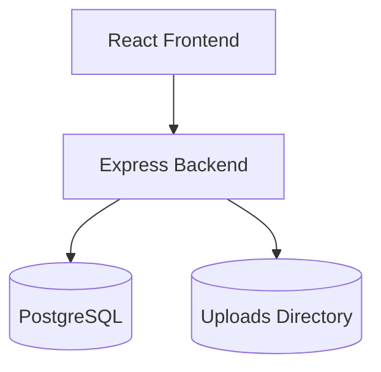

# TRACE Implementation Plan

## 1. Technology Stack

### Frontend

* React
* TypeScript
* Vite
* Tailwind CSS

### Backend

* Node.js
* Express
* TypeScript
* Multer
* pg

### Database

* PostgreSQL

### Storage

* Local filesystem (`uploads/`)

### Security

* Node.js native `crypto` module (SHA-256)

### Reporting

* PDFKit

### Bundle Export

* Archiver

### Testing

* Vitest

---

## 2. Repository Structure

```text
TRACE/
├── backend/
│   ├── src/
│   ├── package.json
│   └── tsconfig.json
│
├── frontend/
│   ├── src/
│   ├── public/
│   └── package.json
│
├── uploads/
│
├── specs/
│   └── 001-trace/
│
└── .specify/
```

---

## 3. System Architecture



### Architecture Rationale

* React + Vite enables rapid frontend development.
* Express provides a simple REST API layer.
* PostgreSQL guarantees transactional consistency for audit logs.
* Local filesystem storage simplifies deployment and demonstrations.
* SHA-256 hashing provides deterministic evidence verification.

---

## 4. Database Design

### Cases

| Column       | Type      |
| ------------ | --------- |
| id           | UUID      |
| reference_id | VARCHAR   |
| title        | VARCHAR   |
| description  | TEXT      |
| created_by   | VARCHAR   |
| created_at   | TIMESTAMP |

### Evidence

| Column            | Type      |
| ----------------- | --------- |
| id                | UUID      |
| case_id           | UUID      |
| original_filename | VARCHAR   |
| stored_filename   | VARCHAR   |
| file_size_bytes   | BIGINT    |
| mime_type         | VARCHAR   |
| sha256_hash       | CHAR(64)  |
| uploaded_by       | VARCHAR   |
| uploaded_at       | TIMESTAMP |

### Custody Logs

| Column        | Type      |
| ------------- | --------- |
| id            | UUID      |
| case_id       | UUID      |
| evidence_id   | UUID      |
| action_type   | VARCHAR   |
| actor         | VARCHAR   |
| details       | TEXT      |
| prev_log_hash | CHAR(64)  |
| log_hash      | CHAR(64)  |
| created_at    | TIMESTAMP |

---

## 5. Chain-of-Custody Design

Each custody event is linked to the previous event using SHA-256.

### Log Hash Formula

```text
log_hash =
SHA256(
    id +
    case_id +
    evidence_id +
    action_type +
    actor +
    details +
    prev_log_hash
)
```

### Verification Procedure

1. Load all logs ordered by creation timestamp.
2. Recalculate each hash.
3. Verify previous hash references.
4. Fail validation if:

   * any hash differs
   * any link is broken
   * any entry is missing

---

## 6. API Response Standard

### Success

```json
{
  "success": true,
  "data": {}
}
```

### Error

```json
{
  "success": false,
  "error": "Human-readable message"
}
```

---

## 7. API Endpoints

### Cases

#### Create Case

```http
POST /api/cases
```

#### List Cases

```http
GET /api/cases
```

#### Get Single Case

```http
GET /api/cases/:id
```

---

### Evidence

#### Upload Evidence

```http
POST /api/cases/:id/evidence
```

#### Transfer Custody

```http
POST /api/evidence/:id/transfer
```

#### Verify Evidence

```http
POST /api/evidence/:id/verify
```

---

### Reports

#### Generate PDF

```http
GET /api/cases/:id/report
```

#### Download Bundle

```http
GET /api/cases/:id/bundle
```

---

## 8. File Storage Design

```text
uploads/
└── case-id/
    └── evidence-id
```

### Storage Rules

* Original filenames are never used on disk.
* Files are renamed using UUIDs.
* Original names are stored in PostgreSQL.
* Uploaded files are treated as read-only.

---

## 9. Frontend Layout

### Sidebar

* Case list
* Create case button

### Case View

* Case metadata
* Evidence catalog

### Timeline

* Chronological custody history

### Action Bar

* Upload Evidence
* Verify Integrity
* Export PDF
* Download Bundle

---

## 10. Development Milestones

### Milestone 1

* Backend scaffold
* Frontend scaffold
* PostgreSQL setup

### Milestone 2

* Case APIs
* Database integration

### Milestone 3

* Evidence uploads
* SHA-256 hashing

### Milestone 4

* Custody log engine
* Timeline UI

### Milestone 5

* Integrity verification

### Milestone 6

* PDF reports

### Milestone 7

* ZIP bundle export

### Milestone 8

* Tampering simulations
* Final demo preparation

```
```

