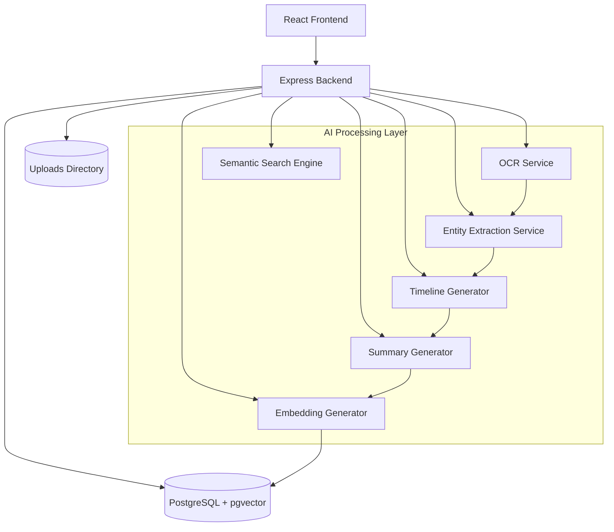

# TRACE Implementation Plan

## 1. Technology Stack

### Frontend

* React
* TypeScript
* Vite
* Tailwind CSS

### Backend

* Node.js
* Express
* TypeScript
* Multer
* pg
* `@google/genai` (for AI summarization, timeline generation, entity extraction, and embeddings)
* `tesseract.js` (for server-side image OCR processing)

### Database

* PostgreSQL with `pgvector` extension

### Storage

* Local filesystem (`uploads/`)

### Security

* Node.js native `crypto` module (SHA-256)

### Reporting

* PDFKit

### Bundle Export

* Archiver

### Testing

* Vitest

---

## 2. Repository Structure

```text
TRACE/
├── backend/
│   ├── src/
│   ├── package.json
│   └── tsconfig.json
│
├── frontend/
│   ├── src/
│   ├── public/
│   └── package.json
│
├── uploads/
│
├── specs/
│   └── 001-trace/
│
└── .specify/
```

---

## 3. System Architecture



### Architecture Rationale

* React + Vite enables rapid frontend development.
* Express provides a simple REST API layer.
* PostgreSQL guarantees transactional consistency for audit logs, and `pgvector` adds local, low-latency vector similarity operations for search.
* Local filesystem storage simplifies deployment and demonstrations.
* SHA-256 hashing provides deterministic evidence verification.
* The modular AI Processing Layer isolates extraction, analysis, and generation tasks to support robust and explainable execution.

---

## 4. Database Design

### Cases

| Column       | Type      |
| ------------ | --------- |
| id           | UUID      |
| reference_id | VARCHAR   |
| title        | VARCHAR   |
| description  | TEXT      |
| created_by   | VARCHAR   |
| created_at   | TIMESTAMP |

### Evidence

| Column            | Type      |
| ----------------- | --------- |
| id                | UUID      |
| case_id           | UUID      |
| original_filename | VARCHAR   |
| stored_filename   | VARCHAR   |
| file_size_bytes   | BIGINT    |
| mime_type         | VARCHAR   |
| sha256_hash       | CHAR(64)  |
| uploaded_by       | VARCHAR   |
| uploaded_at       | TIMESTAMP |

### Custody Logs

| Column        | Type      |
| ------------- | --------- |
| id            | UUID      |
| case_id       | UUID      |
| evidence_id   | UUID      |
| action_type   | VARCHAR   |
| actor         | VARCHAR   |
| details       | TEXT      |
| prev_log_hash | CHAR(64)  |
| log_hash      | CHAR(64)  |
| created_at    | TIMESTAMP |

### OCR Documents

| Column         | Type      |
| -------------- | --------- |
| id             | UUID      |
| evidence_id    | UUID      |
| extracted_text | TEXT      |
| status         | VARCHAR   |
| error_message  | TEXT      |
| processed_at   | TIMESTAMP |

### Extracted Entities

| Column          | Type      |
| --------------- | --------- |
| id              | UUID      |
| case_id         | UUID      |
| evidence_id     | UUID      |
| entity_type     | VARCHAR   |
| entity_value    | VARCHAR   |
| context_snippet | TEXT      |
| created_at      | TIMESTAMP |

### Timeline Events

| Column              | Type      |
| ------------------- | --------- |
| id                  | UUID      |
| case_id             | UUID      |
| event_date          | TIMESTAMP |
| title               | VARCHAR   |
| description         | TEXT      |
| explanation         | TEXT      |
| source_evidence_ids | UUID[]    |
| created_at          | TIMESTAMP |

### Case Summaries

| Column             | Type      |
| ------------------ | --------- |
| id                 | UUID      |
| case_id            | UUID      |
| summary_text       | TEXT      |
| cited_evidence_ids | UUID[]    |
| created_at         | TIMESTAMP |
| updated_at         | TIMESTAMP |

### Search Embeddings

| Column      | Type         |
| ----------- | ------------ |
| id          | UUID         |
| case_id     | UUID         |
| entity_type | VARCHAR      |
| entity_id   | UUID         |
| content     | TEXT         |
| embedding   | VECTOR(1536) |
| created_at  | TIMESTAMP    |

---

## 5. Chain-of-Custody Design

Each custody event is linked to the previous event using SHA-256.

### Log Hash Formula

```text
log_hash =
SHA256(
    id +
    case_id +
    evidence_id +
    action_type +
    actor +
    details +
    prev_log_hash
)
```

### Verification Procedure

1. Load all logs ordered by creation timestamp.
2. Recalculate each hash.
3. Verify previous hash references.
4. Fail validation if:

   * any hash differs
   * any link is broken
   * any entry is missing

---

## 6. API Response Standard

### Success

```json
{
  "success": true,
  "data": {}
}
```

### Error

```json
{
  "success": false,
  "error": "Human-readable message"
}
```

---

## 7. API Endpoints

### Cases

#### Create Case

```http
POST /api/cases
```

#### List Cases

```http
GET /api/cases
```

#### Get Single Case

```http
GET /api/cases/:id
```

---

### Evidence

#### Upload Evidence

```http
POST /api/cases/:id/evidence
```

#### Transfer Custody

```http
POST /api/evidence/:id/transfer
```

#### Verify Evidence

```http
POST /api/evidence/:id/verify
```

---

### Reports

#### Generate PDF

```http
GET /api/cases/:id/report
```

#### Download Bundle

```http
GET /api/cases/:id/bundle
```

---

### AI Evidence Intelligence

#### Process Evidence

```http
POST /api/evidence/:id/process
```

* **Description:** Triggers asynchronous AI processing for an uploaded evidence item (OCR text extraction, entity extraction, timeline event suggestion, and search embedding generation).
* **Response Format:**
```json
{
  "success": true,
  "message": "AI processing queued",
  "data": {
    "evidence_id": "00000000-0000-0000-0000-000000000000",
    "status": "PENDING"
  }
}
```

#### Get Case Entities

```http
GET /api/cases/:id/entities
```

* **Description:** Retrieves all extracted entities parsed from evidence associated with a specific case.
* **Response Format:**
```json
{
  "success": true,
  "data": [
    {
      "id": "11111111-1111-1111-1111-111111111111",
      "case_id": "00000000-0000-0000-0000-000000000000",
      "evidence_id": "22222222-2222-2222-2222-222222222222",
      "entity_type": "UPI_ID",
      "entity_value": "payee@upi",
      "context_snippet": "Please pay to payee@upi as requested.",
      "created_at": "2026-06-12T22:00:00Z"
    }
  ]
}
```

#### Get AI-Reconstructed Timeline

```http
GET /api/cases/:id/timeline-ai
```

* **Description:** Retrieves the list of advisory, AI-reconstructed timeline events for a specific case, including explanations and links to source evidence.
* **Response Format:**
```json
{
  "success": true,
  "data": [
    {
      "id": "33333333-3333-3333-3333-333333333333",
      "case_id": "00000000-0000-0000-0000-000000000000",
      "event_date": "2026-06-03T10:00:00Z",
      "title": "Payment Requested",
      "description": "A payment of ₹5000 was requested.",
      "explanation": "Extracted from chat screenshot where payment request was made.",
      "source_evidence_ids": ["22222222-2222-2222-2222-222222222222"],
      "created_at": "2026-06-12T22:00:00Z"
    }
  ]
}
```

#### Get Case Summary

```http
GET /api/cases/:id/summary
```

* **Description:** Retrieves the latest generated case summary or generates a new one. Supports manual regeneration via a query parameter `?regenerate=true`.
* **Response Format:**
```json
{
  "success": true,
  "data": {
    "id": "44444444-4444-4444-4444-444444444444",
    "case_id": "00000000-0000-0000-0000-000000000000",
    "summary_text": "Case Summary: The case involves internal fraud...",
    "cited_evidence_ids": ["22222222-2222-2222-2222-222222222222"],
    "created_at": "2026-06-12T22:00:00Z",
    "updated_at": "2026-06-12T22:00:00Z"
  }
}
```

#### Execute Natural Language Search

```http
POST /api/search
```

* **Request Format:**
```json
{
  "case_id": "00000000-0000-0000-0000-000000000000",
  "query": "Show all evidence mentioning ₹5000"
}
```
* **Response Format:**
```json
{
  "success": true,
  "data": [
    {
      "entity_type": "ocr",
      "entity_id": "55555555-5555-5555-5555-555555555555",
      "content": "Please send ₹5000 immediately.",
      "similarity": 0.89
    }
  ]
}
```

---

## 8. File Storage Design

```text
uploads/
└── case-id/
    └── evidence-id
```

### Storage Rules

* Original filenames are never used on disk.
* Files are renamed using UUIDs.
* Original names are stored in PostgreSQL.
* Uploaded files are treated as read-only.

---

## 9. Frontend Layout

### Sidebar

* Case list
* Create case button

### Case View

* Case metadata
* Evidence catalog

### Timeline

* Chronological custody history

### Action Bar

* Upload Evidence
* Verify Integrity
* Export PDF
* Download Bundle

---

## 10. Development Milestones

### Milestone 1

* Backend scaffold
* Frontend scaffold
* PostgreSQL setup

### Milestone 2

* Case APIs
* Database integration

### Milestone 3

* Evidence uploads
* SHA-256 hashing

### Milestone 4

* Custody log engine
* Timeline UI

### Milestone 5

* Integrity verification

### Milestone 6

* PDF reports

### Milestone 7

* ZIP bundle export

### Milestone 8

* Tampering simulations
* Final demo preparation

---

## 11. AI Processing Layer

The AI Processing Layer extends TRACE by providing automated text extraction, semantic analysis, structured timeline suggestions, and semantic search. It consists of the following modular components:

### OCR Service
* **Purpose:** Extract readable textual data from uploaded images (screenshots of chats, photos of documents, scanned PDFs).
* **Implementation:** Uses `tesseract.js` server-side. The worker checks if the uploaded file's MIME type matches `image/*`, extracts text lines, updates the `ocr_documents` record, and changes status from `PENDING` to `COMPLETED` or `FAILED`.

### Entity Extraction Service
* **Purpose:** Scan extracted text to identify key forensic and transaction attributes.
* **Implementation:**
  * **Rule-based extraction (regex):** Emails, URLs, Phone Numbers, UPI IDs, and Transaction IDs.
  * **NLP-based extraction (LLM):** Names, Dates, Times, and Organizations.
* **Output:** Entities are stored in the `extracted_entities` table and linked back to both the evidence item and the parent case.

### Timeline Generator
* **Purpose:** Suggest chronological events in an investigation automatically from document dates and transaction messages.
* **Implementation:** The service parses dates/times found by the entity extractor and generates timeline entries. Every suggested event retains a cryptographic reference (foreign key) to the supporting evidence ID, with an explanation text.

### Summary Generator
* **Purpose:** Compile an easily readable overview of the case file, highlighting timeline flow and critical entities.
* **Implementation:** Aggregates case data and prompts the LLM to write a concise case summary. The prompt enforces a strict separation between physical/hash-verified facts and AI-inferred facts, requiring direct document citations (e.g., `[Evidence Name](evidence_uuid)`).

### Embedding Generator
* **Purpose:** Transform textual evidence (OCR outputs, notes, summaries) into high-dimensional vector representations.
* **Implementation:** Feeds extracted text to an embedding model (e.g., Gemini's embedding API) to compute 1536-dimensional vector coordinates.

### Semantic Search Engine
* **Purpose:** Allow investigators to query cases using conversational search queries.
* **Implementation:** Converts the user query into a vector embedding and queries the database using `pgvector`'s cosine similarity operator (`<=>`), sorting matches by proximity.

---

## 12. Processing Workflows

### Evidence Ingestion & AI Processing Sequence

```mermaid
sequenceDiagram
    autonumber
    actor Investigator as Investigator
    participant UI as React Frontend
    participant API as Express Backend
    participant Worker as Background AI Worker
    participant DB as PostgreSQL (pgvector)
    
    Investigator->>UI: Upload Chat Screenshot
    UI->>API: POST /api/cases/:id/evidence
    API->>DB: Save Evidence Metadata & Custody Log (Tx)
    API-->>UI: Upload Success (Status: Pending AI)
    API->>Worker: Trigger Background AI Process
    
    rect rgb(20, 20, 30)
        note right of Worker: Async Processing Pipeline
        Worker->>Worker: Run OCR (Tesseract.js)
        Worker->>DB: Save to ocr_documents (COMPLETED)
        Worker->>Worker: Extract Entities (Regex + LLM)
        Worker->>DB: Save to extracted_entities
        Worker->>Worker: Generate Vector Embeddings
        Worker->>DB: Save to search_embeddings
        Worker->>Worker: Update Timeline Suggestions & Case Summary
        Worker->>DB: Save to timeline_events & case_summaries
    end
```



---

## 13. MVP vs Future AI Features

To ensure project feasibility within the hackathon timeline, features are prioritized as follows:

### MVP AI Features (Hackathon Scope)
* **Local OCR:** Local node-based OCR using `tesseract.js` for images up to 10MB.
* **Deterministic NER:** Regular expressions for pattern-matching emails, phone numbers, URLs, UPI IDs, and transaction codes.
* **Lightweight LLM Analytics:** Gemini API integrations for Names, Organizations, timeline suggestions, and case summaries.
* **Semantic Search:** Store vectors in local PostgreSQL using pgvector, running simple similarity query sorting.
* **Visual Advisory UI:** Add-on panels in the case view showing AI summaries, extracted entity tags, and an AI advisory timeline, separated visually from the immutable custody audit log.

### Future AI Features (Production Roadmap)
* **Large File / Video OCR:** Handling large multi-page PDF files and extracting text from video evidence frames.
* **Offline Embeddings:** Local self-hosted ONNX model execution (e.g. all-MiniLM-L6-v2) to support fully isolated environments.
* **Cross-Case Linkage:** Automated entity resolution across separate cases to detect recurring actors or UPI accounts.
* **Audio Transcripts:** Integration of Whisper/speech-to-text models for recorded audio evidence files.
* **Hybrid Search Reranking:** Combining TF-IDF/BM25 lexical search with pgvector semantic search using Reciprocal Rank Fusion (RRF).
